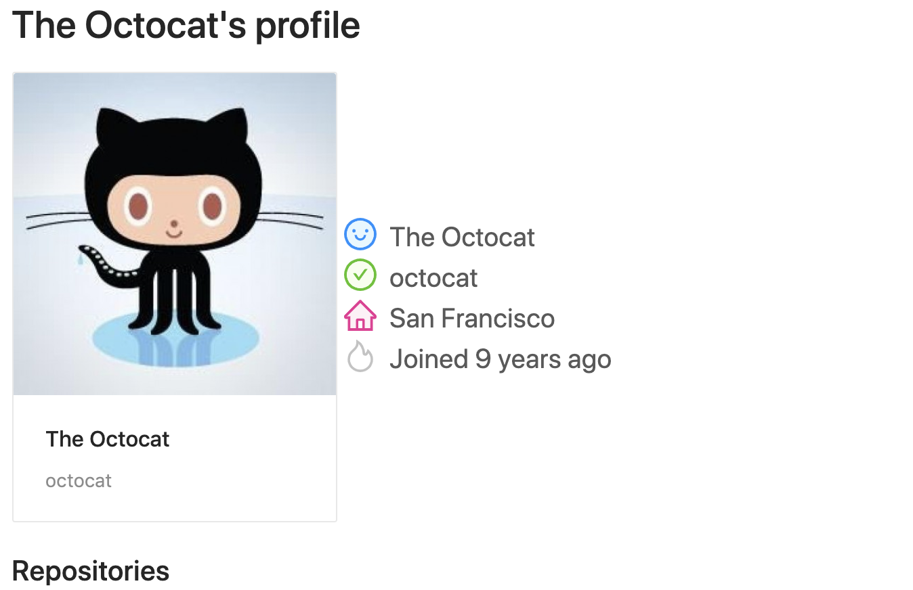

# Search Github Profile



Search your favorite profile with Github OAuth App

## Setup

You need to create a `.env` file. Take a look the `.env.example` file.

## Development setup

```sh
npm install
npm run dev
```

## Stack

* NextJS
* Typescript
* Express
